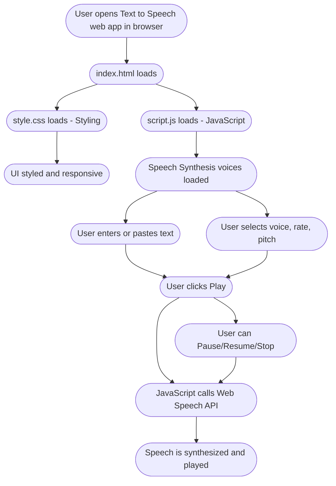

# 🗣️ Text to Speech Web App

## 🖼️ Workflow Diagram



---

A simple, user-friendly Text to Speech web application that converts written text into spoken words using your browser's built-in speech synthesis capabilities. Built with pure HTML, CSS, and JavaScript, this app is lightweight, responsive, and works across modern browsers.


## 🚀 Live Demo

[https://sinha-19.github.io/Text-to-speech/](https://sinha-19.github.io/Text-to-speech/)

---

## 📂 Project Structure

```
Text-to-speech/
├── .vscode/                 # VSCode settings (optional)
├── images/                  # App icons and images
│   ├── dropdown.png
│   └── play.png
├── index.html               # Main HTML file
├── script.js                # Main JavaScript file
├── style.css                # App styling
└── README.md                # Documentation
```

---

## Features

- **Text Input:** Easily enter or paste any text to be read aloud.
- **Voice Selection:** Choose from available voices and languages (browser/system dependent).
- **Adjustable Rate and Pitch:** Fine-tune how the speech sounds.
- **Play/Pause/Stop Controls:** Manage speech playback.
- **Responsive Design:** Works on desktop and mobile.
- **No dependencies:** Uses native Web Speech API.

---

## How It Works

1. User visits the app at the deployment URL.
2. `index.html` is loaded in the browser.
3. `style.css` applies visual styling.
4. `script.js` initializes:
    - Loads available speech synthesis voices.
    - Populates the voice dropdown.
    - Listens for user input and button clicks.
    - Uses the [Web Speech API](https://developer.mozilla.org/en-US/docs/Web/API/SpeechSynthesis) to speak the text.
5. The UI responds to user actions (play, pause, stop, change voice/rate/pitch).

---

## Usage

1. **Enter text:**  
   Type or paste your desired text in the provided area.

2. **Select voice, rate, and pitch:**  
   Choose from the dropdown and sliders to customize the speech.

3. **Click the Play button:**  
   The app will read the text aloud using your chosen settings.

4. **Use Pause, Resume, or Stop as needed:**  
   Control speech playback at any time.

---

## Run Locally

1. **Clone the repository:**
    ```sh
    git clone https://github.com/sinha-19/Text-to-speech.git
    cd Text-to-speech
    ```

2. **Open `index.html` in your browser.**

---

## Browser Compatibility

- Works on Chrome, Firefox, Edge, and Safari.
- Voice availability and quality may vary by browser and operating system.

---

## License

MIT License

---
